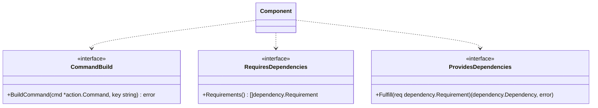
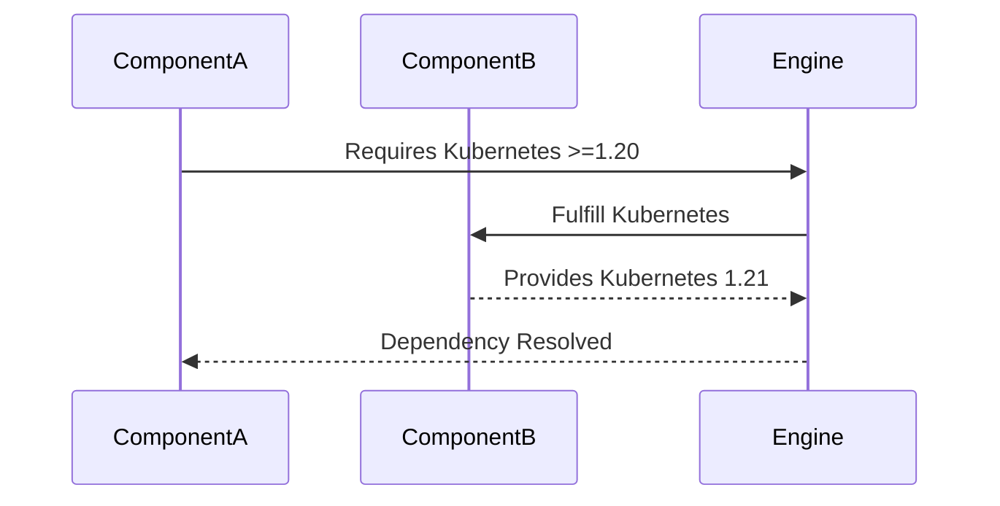
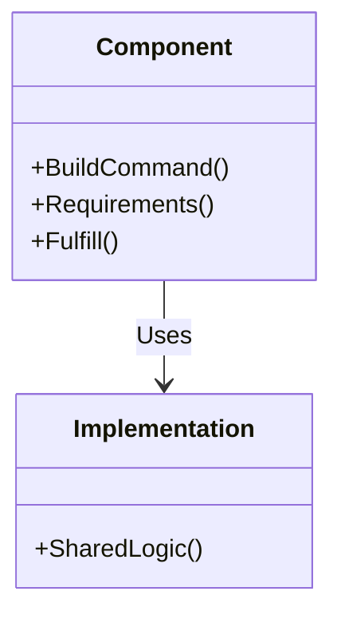

# Components

## What is a Component?
A **Component** is a modular unit in Launchpad that:
1. **Builds commands** (e.g., `apply`, `reset`).
2. **Provides/requires dependencies** (e.g., Kubernetes API, host roles).
3. **Implements interfaces** (e.g., `action.CommandBuild`).

Components enable **extensibility** by allowing new products (e.g., MKE, MSR) to be added via registration.

---

## Key Interfaces

### Diagram: Component Interfaces


### 1. `action.CommandBuild`
**Purpose**: Add execution phases to commands.
**Example**:
```go
func (c *MyComponent) BuildCommand(cmd *action.Command, key string) error {
  if key == "apply" {
    cmd.AddPhase(&MyPhase{})
  }
  return nil
}
```

---

### 2. Dependency Management
#### `dependency.RequiresDependencies`
**Purpose**: Declare required dependencies (e.g., host roles).
**Example**:
```go
func (c *MyComponent) Requirements() []dependency.Requirement {
  return []dependency.Requirement{
    host.NewHostRolesRequirement("worker"),
  }
}
```

#### `dependency.ProvidesDependencies`
**Purpose**: Fulfill dependencies for other components.

**Diagram: Dependency Flow**


**Example**:
```go
func (c *MyComponent) Fulfill(req dependency.Requirement) (dependency.Dependency, error) {
  if req.Type() == "kubernetes" {
    return &KubernetesDependency{}, nil
  }
  return nil, errors.New("unsupported requirement")
}
```

---

## Registration
**Process**:
1. Define a `ProductDecoder` in `init()`:
   ```go
   func init() {
     product.RegisterDecoder("my-component", NewMyComponentDecoder)
   }
   ```
2. Add the component to `project.Project`.

**Diagram: Registration Flow**
```mermaid
flowchart TD
  A[init()] -->|RegisterDecoder| B[product.Register]
  B -->|Add to Project| C[project.Project]
  C -->|Build Commands| D[CLI]
```

---

## Implementations vs. Components
| **Implementations**       | **Components**               |
|---------------------------|------------------------------|
| Shared functionality (e.g., Kubernetes API). | Project-specific logic.      |
| No direct role in commands. | Build commands and phases.   |

**Diagram: Component vs. Implementation**


**Example**: Both MKE and K0s components may provide the same Kubernetes implementation.