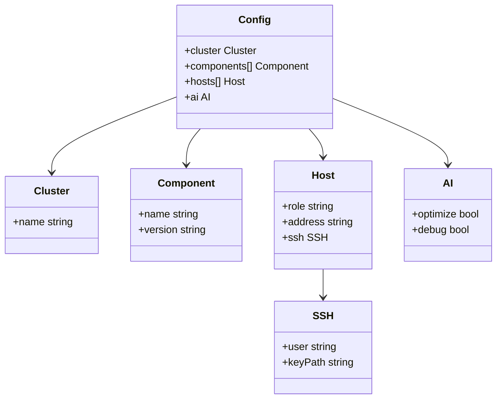
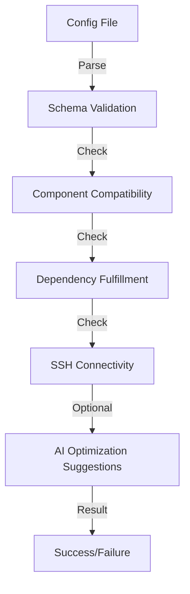

# Configuration

## Overview
Launchpad uses YAML files to define cluster configurations.
**Example**: [`examples/basic.yaml`](./examples/basic.yaml)

---

## Schema
### Diagram: Configuration Hierarchy


### Required Fields
```yaml
cluster:
  name: "my-cluster"
components:
  - name: "mke"
    version: "3.6.0"
  - name: "msr"
    version: "2.9.0"
```

### Advanced Fields
```yaml
hosts:
  - role: "manager"
    address: "192.168.1.10"
    ssh:
      user: "ubuntu"
      keyPath: "~/.ssh/id_rsa"
```

### AI-Optimized Fields (Optional)
```yaml
ai:
  optimize: true  # Enable AI-driven optimization during `apply`.
  debug: true     # Enable AI-driven troubleshooting during `discover`.
```

---

## Validation
**Command**:
```bash
launchpad validate --config <file.yaml>
```

**Diagram: Validation Flow**


**Checks**:
- Component compatibility.
- Dependency fulfillment.
- SSH connectivity.
- AI optimization suggestions (if enabled).

---

## Validation
**Command**:
```bash
launchpad validate --config <file.yaml>
```
**Checks**:
- Component compatibility.
- Dependency fulfillment.
- SSH connectivity.
- AI optimization suggestions (if enabled).